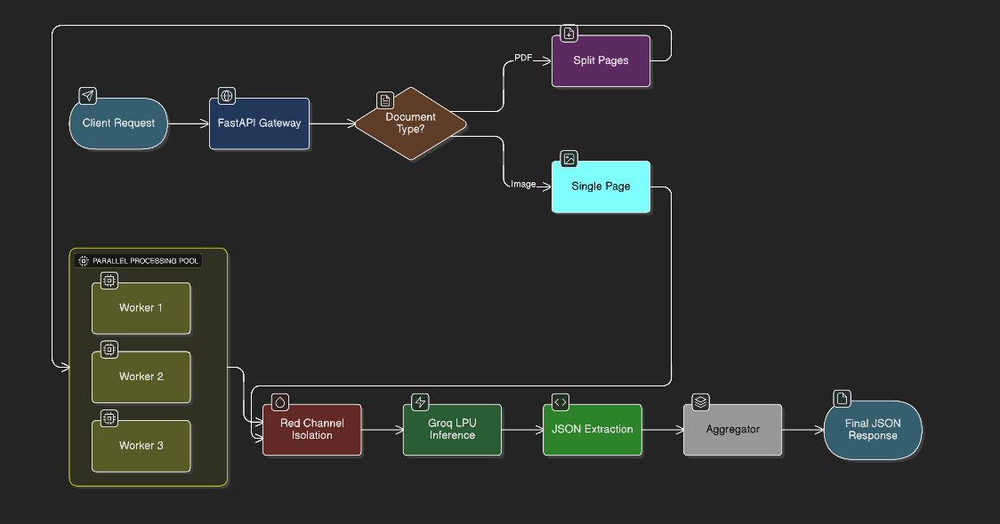

🧾 Intelligent Bill Extraction API (BFHL Datathon)

Status: Deployed on Render 🟢

Inference: Accelerated by Groq LPU ⚡

A high-performance, AI-powered API designed to extract structured line items and discounts from complex Indian medical bills. Engineered to handle yellow carbon paper, cursive handwriting, and implicit discounts with sub-second latency.

🚀 Key Features & USPs

1. Physics-Based Preprocessing (The "Secret Sauce")

Medical bills often come on yellow/pink carbon paper, which standard OCR engines fail to read due to low contrast.

Our Solution: We implement Red Channel Isolation. By extracting the red channel from the RGB image, we mathematically neutralize the yellow background (turning it white) while keeping the blue/black ink dark. This significantly boosts accuracy before the AI even sees the image.

2. O(1) Latency Scaling (Parallel Processing)

Most APIs process multi-page PDFs sequentially (Linear Time).

Our Solution: We use a ThreadPoolExecutor to split PDFs into images and process all pages concurrently.

Result: A 50-page invoice processes in nearly the same time as a 1-page invoice, bounded only by the worker count.

3. Semantic Discount Logic

Discounts are often hidden in footer text (e.g., "Loyalty Savings: 10%") rather than in the table grid.

Our Solution: Our Llama Vision prompt is engineered to scan the entire document layout for "hidden" discount keywords (Less, Saving, Rebate) and apply them to the final calculation.

🛠️ Tech Stack

Component

Technology

Reasoning

Backend

FastAPI (Python)

Native async support for high-concurrency handling.

Inference

Groq LPU

Deterministic hardware that eliminates memory bandwidth bottlenecks, offering 10x faster token generation than GPUs.

Model

Llama 4 Scout (17B)

Multimodal Vision model capable of understanding spatial grid layouts and context.

Deployment

Render

Auto-scaling PaaS for reliable uptime during traffic spikes.

Processing

PyMuPDF & Pillow

High-speed PDF rendering and pixel-level image manipulation.

⚡ Architecture & Data Flow

⚙️ Installation & Setup

Clone the Repository

git clone [https://github.com/your-username/bill-extractor.git](https://github.com/your-username/bill-extractor.git)
cd bill-extractor

Install Dependencies

pip install -r requirements.txt

Environment Configuration
Create a .env file in the root directory:

GROQ_API_KEY=gsk_your_key_here

Run the Server

uvicorn main:app --reload --host 0.0.0.0 --port 8000

🔌 API Documentation

Endpoint: POST /extract-bill-data

Request:

{
  "document": "[https://example.com/invoice.pdf](https://example.com/invoice.pdf)"
}

Response:

{
  "is_success": true,
  "data": {
    "pagewise_line_items": [
      {
        "page_no": "1",
        "bill_items": [
          {
            "item_name": "Tab. PCM 500mg",
            "item_amount": 45.00,
            "item_quantity": 10
          }
        ],
        "discounts": [
           {
             "description": "Loyalty Savings",
             "amount": 5.00
           }
        ]
      }
    ],
    "total_item_count": 1,
    "total_discount_count": 1
  }
}

🔮 Future Roadmap (Scaling to Enterprise)

To make this solution robust for millions of requests, we are moving towards a Hybrid Neuro-Symbolic Architecture:

1. Cost & Token Reduction (Hybrid Pipeline)

Current: Sending full images to Llama Vision (~1000 tokens/page).

Future: 1.  Use PaddleOCR (lightweight, 0 cost) to extract raw text.
2.  Send text to Llama 3.2 1B (SLM) to structure the JSON.

Impact: Reduces token costs by 90%.

2. Event-Driven Infrastructure

Current: Synchronous HTTP connections (Risk of timeouts on large files).

Future: Decouple ingestion from processing using Redis Queues. The API will return a Job ID immediately, and background workers will process the file asynchronously.

3. Domain Adaptation (Fine-Tuning)

Current: General purpose Llama 4 model.

Future: Distill knowledge from Llama 70B into a smaller 8B model fine-tuned via LoRA specifically on Indian medical datasets to master shorthand (e.g., "Tab.", "Syp.", "Inj.").

👨‍💻 Author

[Your Name] BFHL Datathon Finalist